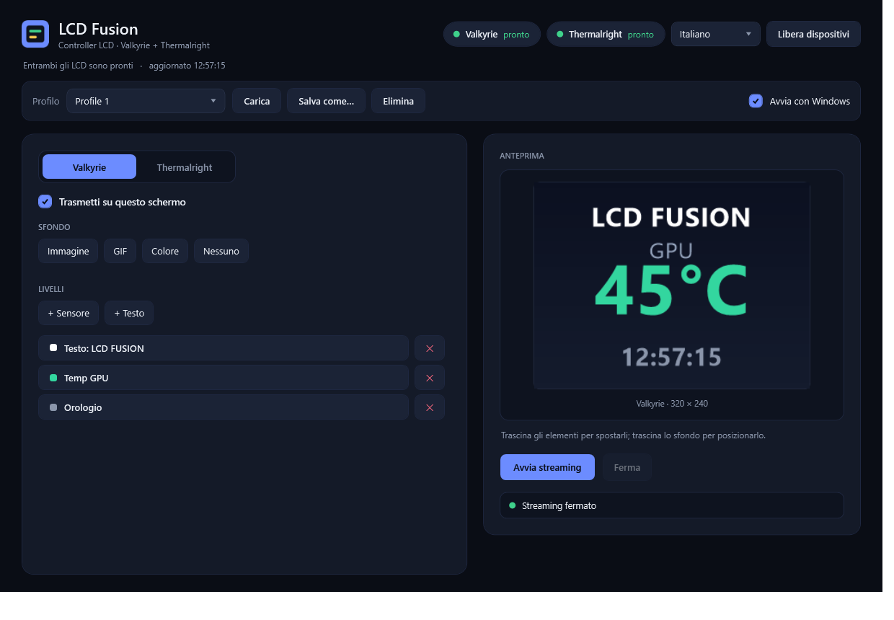

# LCD Fusion

**A standalone Windows controller for AIO‑cooler LCD screens — drive them without the vendor software.**

LCD Fusion talks directly to the USB displays found on **Valkyrie** (Myth.Cool) and **Thermalright** (TRCC) all‑in‑one coolers, so you can show images, GIFs, custom text and **live CPU/GPU sensors** without keeping the vendor apps running.

> Unofficial, community project. Not affiliated with or endorsed by Valkyrie, Thermalright, Myth.Cool or TRCC.



---

## Features

- **Per‑screen editor** — each LCD is configured independently (its own background, layers, transforms).
- **Backgrounds** — image, animated GIF, solid color, or none, with **rotation (any angle), mirror, zoom, fit/fill and free drag‑to‑pan**.
- **Layers** — movable text and **sensor widgets** (CPU/GPU temperature and load, clock, date) that you can drop **on top of an image**, each with its own size, rotation and color. Drag on the live preview to position them.
- **Live sensors, self‑contained** — reads CPU/GPU temperatures via the bundled [LibreHardwareMonitorLib](https://github.com/LibreHardwareMonitor/LibreHardwareMonitor); no external monitoring tool required.
- **Profiles** — save complete layouts (with the **images embedded**, so they’re portable). The last session is restored automatically on the next launch.
- **Streaming on by default**, remembered per profile/session.
- **Launch at Windows startup** (optional) and **minimize to the system tray** (keeps streaming).
- **Multilingual UI** — Italiano / English / Deutsch, switchable at runtime.
- **Refined dark UI**, single self‑contained executable plus a few DLLs.

## Supported hardware

| Brand / app            | Panel            | VID / PID   | Resolution | Transport                |
|------------------------|------------------|-------------|------------|--------------------------|
| Valkyrie / Myth.Cool   | Valkyrie AIO LCD | `345F:9132` | 320 × 240  | HID + bulk, UYVY frames  |
| Thermalright / TRCC    | Thermalright LCD | `0416:5408` | 1920 × 462 | WinUSB, JPEG frames      |

The registry of supported products lives in [`LcdFusion/ProductCatalog.cs`](LcdFusion/ProductCatalog.cs) — see [Adding a new product](#adding-a-new-product).

## Requirements

- Windows 10 / 11 (x64).
- .NET Framework 4.7.2+ (ships with Windows 10/11).
- **Administrator rights**: the app requests elevation (UAC). This is required so LibreHardwareMonitor can load its kernel driver and read the **Ryzen CPU temperature**. GPU temperature works without elevation.
- The display interface must be bound to a generic USB driver:
  - **Thermalright** uses **WinUSB**.
  - **Valkyrie** uses **libusb/WinUSB** on interface 3 (the display interface) plus a normal **HID** interface for control. If your panel isn’t detected, bind the display interface with [Zadig](https://zadig.akeo.ie/).
- Close the vendor software (Myth.Cool / TRCC) before streaming — they hold the USB device. The app has a **“Release devices”** button for this.

## Run

Build it (below) and run `LcdFusion\bin\LcdFusion.exe`. Keep these next to the exe:

```
LcdFusion.exe
LibreHardwareMonitorLib.dll
HidSharp.dll
LibUsbDotNet.LibUsbDotNet.dll
```

Profiles and settings are stored under `%APPDATA%\LcdFusion\` (`profiles\*.xml`, `last-session.xml`, `settings.xml`). Autostart is implemented as a Scheduled Task (`LCDFusionAutostart`) with highest privileges, so the elevated app starts at logon without a UAC prompt.

## Build from source

SDK‑style project targeting **.NET Framework 4.8** (WPF + Windows Forms, x86). With the [.NET SDK](https://dotnet.microsoft.com/download) installed:

```powershell
dotnet build LcdFusion/LcdFusion.csproj -c Release
# or produce the portable zip (exe + dependencies):
./pack.ps1 -Version 1.0.0
```

LibUsbDotNet is restored from NuGet; LibreHardwareMonitor / HidSharp are referenced from `tools/`. CI builds and publishes a release on every push to `main`.

---

## How it works

```
MainWindow ──> ContentEngine ──> ValkyrieDirectService     (HID init + bulk UYVY)
  (WPF UI)        (renders     └─> ThermalrightDirectService (WinUSB + JPEG)
                   scenes)     └─> SensorService (LibreHardwareMonitorLib / HWiNFO / WMI)
```

- **`ContentEngine`** holds one `LcdScene` per screen (background + layers), renders each scene to a `System.Drawing.Bitmap` at the panel’s native resolution on a worker thread, and pushes frames to the device services at each panel’s native cadence. It also produces the live preview.
- **`*DirectService`** classes own one USB protocol each. They expose a simple “show this frame” API and run their own streaming loop.
- **`SensorService`** reads CPU/GPU values (LibreHardwareMonitor first, then a running HWiNFO shared‑memory block or OHM/LHM WMI as fallbacks).
- **`Theme.cs`** is the dark design system (a XAML `ResourceDictionary` parsed at startup); **`Loc.cs`** is the string table; **`ProfileService.cs`** serializes scenes (with embedded media) to XML.

### Protocol notes

- **Valkyrie**: a 77‑command HID feature‑report init sequence (including a controller register/gamma ramp) brings the panel up, then 320×240 UYVY frames go out over bulk endpoint `0x04` (`FF 00 00 00 00 14 00 F0` header + 153600 B UYVY + footer), with a periodic `B5 00 32` HID “commit” between frames. Reverse‑engineered from USB captures; without the full init the panel stays black.
- **Thermalright**: a `02 FF` handshake, then JPEG frames (quality 90, 1920×462) split into 512‑byte packets over WinUSB, each frame ACKed, at a steady ~156 ms cadence.

---

## Contributing

Contributions are very welcome — bug fixes, translations, UI polish, and **new product support**.
Issues/PRs in Italian, English or German are all fine.

### Adding a translation

Add a dictionary to [`LcdFusion/Loc.cs`](LcdFusion/Loc.cs) and an entry to `Loc.Codes` / `Loc.Names`. Every UI string already goes through `Loc.T("key")`, so a new language is just a copy of an existing dictionary with translated values.

### Adding a new product

Most AIO LCDs from these brands speak one of a handful of USB protocols. Adding one is usually:

1. **Identify the device.** Find its `VID:PID` (Device Manager → Details → Hardware Ids) and panel resolution. Add an entry to [`LcdFusion/ProductCatalog.cs`](LcdFusion/ProductCatalog.cs).
2. **Does it match an existing protocol?** If the framing/format matches an implemented panel (e.g. another Thermalright JPEG panel at a different resolution), you can often reuse `ThermalrightDirectService` / `ValkyrieDirectService` with the new size — generalize the hard‑coded width/height to read from the catalog entry.
3. **New protocol? Reverse it from a USB capture:**
   - Capture USB with [USBPcap](https://desowin.org/usbpcap/) / Wireshark while the vendor app drives the panel.
   - Analyze with the helpers in [`tools/`](tools): `parse-usbpcap.ps1` (summarize endpoints, dump control/bulk transfers) and `extract-valkyrie-init.ps1` (extract an ordered command sequence). They already understand the USBPcap link type.
   - Diff a working capture against a black/idle one to find the missing init/commit commands.
   - Implement a `FooDirectService` exposing the same shape as the existing services (`Show…()` + a streaming loop + `Stop()`), and have `ContentEngine` push to it.
4. **Wire it into the engine/UI.** `ContentEngine` renders a `Bitmap` at the panel’s size — convert it to the panel’s pixel/wire format inside your service.

If you have a panel but can’t capture it, open an issue with the `VID:PID`, a photo, and the vendor app name — someone with the hardware may help.

### Project layout

```
LcdFusion/                      # the app
  LcdFusion.csproj              # SDK-style project (net48, WPF + WinForms)
  app.manifest, app.ico         # elevation manifest + icon
  MainWindow.cs                 # WPF UI (built in code)
  Theme.cs                      # dark design system (XAML resource dictionary)
  Loc.cs                        # i18n string tables (it/en/de)
  ContentEngine.cs              # scene model + rendering + frame pushing
  ValkyrieDirectService.cs      # Valkyrie HID+bulk UYVY protocol
  ThermalrightDirectService.cs  # Thermalright WinUSB JPEG protocol
  SensorService.cs              # CPU/GPU sensors (LibreHardwareMonitor + fallbacks)
  ProfileService.cs             # profile + settings persistence (XML, embedded media)
  AutoStartService.cs           # launch-at-logon (Scheduled Task)
  ProductCatalog.cs             # supported-product registry
  DeviceService.cs, VendorService.cs
  licenses/                     # third-party license texts
protocol/
  ValkyrieHidInitializer.cs     # full Valkyrie HID init sequence
tools/                          # libusbdotnet, librehardwaremonitor, USB capture parsers
```

## Third‑party

- **LibreHardwareMonitorLib** — MPL‑2.0. https://github.com/LibreHardwareMonitor/LibreHardwareMonitor
- **HidSharp** — Apache‑2.0 / MIT. https://www.zer7.com/software/hidsharp
- **LibUsbDotNet** — LGPL‑3.0. https://github.com/LibUsbDotNet/LibUsbDotNet

License texts are in [`LcdFusion/licenses/`](LcdFusion/licenses). These components are redistributed as binaries; their licenses apply to them.

## License

Released under the [MIT License](LICENSE) © 2026 itsmylife44. The bundled third‑party components keep their own licenses (listed above and under [`LcdFusion/licenses/`](LcdFusion/licenses)).
